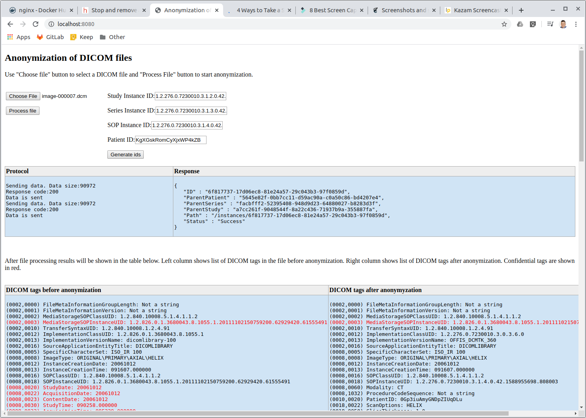

## DICOMANONYMIZER


WebAssembly based DICOM file anonymization. The software strips confidential tags from a DICOM file and sends anonymized content to an orcthanc DICOM server.
## Prerequisites
- Emscripten SDK
- cmake
- docker 
## How to build the WebAssembly on a Linux machine
- Edit build.sh file and define the correct path to the Emscripten toolkit file. It is specified at the beginnig of the file in variable TOOL_CHAIN_PATH.
- Run script build.sh
```
cd DICOMANONYMIZER
./build.sh
```
- Distribution files are copied to the "dist" subfolder of the repository root directory.
## How to build the WebAssembly with docker
```
cd covid19-prototype
docker pull trzeci/emscripten
docker run -it --rm -v $(pwd):/src  trzeci/emscripten ./DICOMAnonymizer/build.sh
```
## How to start a demo
After the WebAssembly is build, switch to the docker subdirectory and run:
```
docker-compose up
```
3 docker containers will be started:
- orthanc server
- nginx revers proxy
- nginx web server.

In the browser type: http://localhost:8080.

In the web page select a file, generate ids and process the file.

## WebAssembly distribution files.
- index.html: HTML file for the WEB page.
- style.cs: Style sheet for the WEB page.
- wrap.js: Javascript that contains the following functions:
- - wrappers for the exposed WebAssembly functions;
- - function for sending of DICOM datasets to an orthanc server;
- - javascript callbacks for the WEB page.
- DICOMAnonymizer.js: Plumbing functions for the WebAssembly.
- DICOMAnonymizer.wasm: The WebAsembly file.
## To build a c++ execution file
```
cd DICOMANONYMIZER
mkdir build
cmake ..
cmake --build .
```
## Repository structure
- Folder "dcmtk/dcmtk-3.6.0": the source code of the dcmtk library.
- Folder "dcmtk/config_wa": files with the configuration of the dcmtk library for the WebAssembly.
- Folder "config_cpp": files with the configuration of the dcmtk library for Linux c++ compilation.
- Folder "dist": location of the WebAssembly distribution files.
- Folder "build": location of temporary build files.
- Folder "tests": c++ unit tests.
- Folder "test_images": location of test images for c++ unit tests.
- Folder "images": location of pictures for the documentation.
- Folder "docker": location for docker-compose file and docker configuration files to start a demo
- Folder "src": location of source files.
- CMakeLists.txt: cmake file for building of the WebAssembly or c++ executable.
- build.sh: script for building of the WebAssembly.

Source files
- anonymize.cpp: c++ code for functions exported from the WebAssembly (exposed to the WEB page).
- stripDataset.h, stripDataset.cpp: functions for the anonymization of a dcmtk dataset.
- utils.h, utils.cpp: functions for saving/loading of dcmtk instances to/from buffer.
- library.js: functions to be called from the WebAssembly to put the information (DICOM tags or error messages) to the WEB page.
- wrap.js: javascript wrapper functions the WebAssembly exposed API and functions sending DICOM information to an orthanc server.
- index.html: HTML code for the WEB page.
- style.css: style sheet for the WEB page.
- main.cpp: main function for c++ executable (for testing).

## C++ API reference
The WebAssembly exposes the following functons.
### anonymizeFile
The function reads DICOM data from an input byte array, removes confidential tags, and saves the data to an output byte array. 

Parameters:
- input (const void*): input byte array with the content of a DICOM file.
- inputLength (size_t): size of the input data in bytes.
- outputData (void*): a buffer for the output data after anonymization.
- outputLength (size_t): length of the buffer for the output data.
- studyId: string with a new study id;
- seriesId: string with a new series id;
- SOPId: string with a new SOP id;
- patientId: string with a new patient id;
- tracingLevel (int): integer 0,1,2 that defines a tracing level (output to the console);c
- - 0: No information.
- - 1: Function calls only.
- - 2: Detailed information.  

File wrap.js contains a wrapper function (anonymizeFile) for calling of the function from javascript.

### printTags
The function reads DICOM data from an input byte array and prints DICOM tags to the WEB page. The location where the information is printed is defined by an HTIML tag - container on the WEB page. Tag information will be added to the parent element as a sequence of "div" HTML elements.

Parameters:
- input (const void*): input byte array with the content of a DICOM file.
- inputLength (size_t): size of the input data in bytes.
- parentHtmlTag (const char*): id of the parent HTML element which should show the information.

File wrap.js contains a wrapper function (printTags) for calling of the function from javascript.

### getFakeId
The function generates fake ids for a study, a serie, SOP, and a patient.

Parameters:
- type: type of id:
- - 0: study id;
- - 1: series id;
- - 2: SOP id;
- - 3: patient id;
- id: buffer where id will be copied;
- buffLen: length of the buffer.

File wrap.js contains a wrapper function (getFakeId) for calling of the function from javascript.

## Javascript API
### anonymizeFile
A javascript wrapper function for calling of WebAssembly function anonymizeFile.

Parameters:
- input: Uint8Array with content of a DICOM file;
- studyId: string with a new study id (can be generated by getFakeId function);
- seriesId: string with a new series id (can be generated by getFakeId function);
- sopId: string with a new SOP id (can be generated by getFakeId function);
- patientId: string with a new patient id (can be generated by getFakeId function);
- tracingLevel:  integer 0,1,2 that defines a tracing level (output to console);
- - 0: No information.
- - 1: Function calls only.
- - 2: Detailed information.

Return value: Uint8Array with anonymized data or null.
Error messages will be sent through sentErrorMessage callback function.

### printTags
A javascript wrapper function for calling of WebAssembly function printTags.

Parameters:
- input (Uint8Array): an array with the content of a DICOM file.
- parentHtmlTag (string): id of HTML element where the information will be printed.

### sendData
The function sends content of DICOM file to a orthanc server (endpoint and credentials are currently hardcoded).

Parameters:
- dicomData (UInt8Array): array with the content of a DICOM file.

### getFakeId
The function generates fake ids for a study, a serie, SOP, and a patient.

Parameters:
- type: type of id:
- - 0: study id;
- - 1: series id;
- - 2: SOP id;
- - 3: patient id.

Return value: a string with requested id.

## Javascript auxillary functions.
The following functions facilitate displaying of information on the WEB page and are called form the WebAssembly. The functions are located in the file "library.js" and embedded to the WebAssembly module during compilation.
### addTagsJS
An auxillary function that prints DICOM tag information to the WEB page.

Parameters:
- parentHtmlTagNameUTF8 (utf8 string): id of an HTML element used to display the information.
- s (utf8 string): DICOM tag information
- confidential (boolean): true if the tag is confidential.
### showErrorMessageJS
Auxillary function to display error messages on the WEB page.

Parameters:
- errorMessageUTF8 (utf8 string): error message.

## Used software
- DCMTK library
- Repository Parsing DICOM using WebAssembly (https://github.com/jodogne/wasm-dicom-parser)
- Emscripten framework
- cmake
- docker
- docker container trzeci/emscripten


